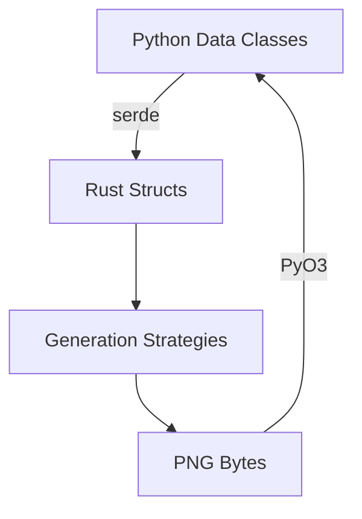

# 🌉 Python Integration Roadmap

This document outlines the architectural choices and implementation plan for integrating the Rust chart kernel with the Python/Django backend.

## 🎯 Bridge Architecture Selection

### **Chosen Approach: Native PyO3 Extension Module**

**Decision**: We have formally selected the **Native PyO3 Extension Module** compiled via **Maturin**, matching the baseline design pattern of the `iyou_idp` cryptographic framework.

**Rationale**:
- ✅ **Performance**: Native Rust extensions provide maximum performance
- ✅ **Type Safety**: PyO3 offers strong typing between Rust and Python
- ✅ **Maturin Integration**: Proven build system with Python packaging support
- ✅ **Production Ready**: Used successfully in `iyou_idp` framework
- ✅ **Maintainability**: Clean FFI boundary with Rust ownership guarantees

**Implementation Pattern**:
```rust
// Rust side (using PyO3)
#[pyfunction]
fn generate_chart(
    generation: u8,
    primary: PythonPersonData,
    ancestors: Vec<PythonPersonData>,
    settings: PythonChartSettings
) -> PyResult<Vec<u8>> {
    // Convert Python data to Rust types
    let rust_primary = primary.into_rust();
    let rust_ancestors = ancestors.into_rust();
    let rust_settings = settings.into_rust();
    
    // Generate chart using unified generator
    let generator = UnifiedChartGenerator::new(rust_settings);
    let result = generator.generate(generation, &rust_primary, &rust_ancestors);
    
    // Return PNG bytes
    result.map_err(Into::into)
}

// Python side
from iyou_chart_kernel import generate_chart

png_bytes = generate_chart(
    generation=3,
    primary=person_data,
    ancestors=ancestor_list,
    settings=chart_settings
)
```

### **Serialization Interface Design**

**Decision**: The FFI layer will accept native Python data classes and mapping dictionaries, leveraging automated serde deserialization gates.

**Data Flow**:


**Python → Rust Conversion**:
```python
# Python data classes (using pydantic or dataclasses)
@dataclass
class PythonPersonData:
    id: str
    full_name: str
    given_name: str
    surname: str
    birth_date: Optional[str]
    birth_place: Optional[str]
    death_date: Optional[str]
    death_place: Optional[str]

# Automatic serde deserialization
impl From<PythonPersonData> for PersonData {
    fn from(py_data: PythonPersonData) -> Self {
        PersonData {
            id: py_data.id,
            full_name: py_data.full_name,
            // ... other fields
        }
    }
}
```

**Error Handling**:
```rust
// Automatic PyO3 error conversion
impl From<ChartError> for PyErr {
    fn from(err: ChartError) -> PyErr {
        match err {
            ChartError::MagickError(e) => PyRuntimeError::new_err(e.to_string()),
            ChartError::InvalidSettings(msg) => PyValueError::new_err(msg),
            // ... other error types
        }
    }
}
```

## 🗺️ Implementation Roadmap

### Phase 1: PyO3 Extension Setup
**Duration**: 1 week

1. **Add PyO3 Dependencies**
   ```toml
   [dependencies]
   pyo3 = { version = "0.18", features = ["extension-module"] }
   
   [lib]
   name = "iyou_chart_kernel"
   crate-type = ["cdylib"]
   ```

2. **Create Python Module Structure**
   ```
   iyou_chart_kernel/
   ├── Cargo.toml
   ├── src/
   │   ├── lib.rs          # PyO3 module entry
   │   ├── python_types.rs # Python data classes
   │   └── bridge.rs       # FFI bridge functions
   └── __init__.py        # Python package init
   ```

3. **Implement Basic FFI Functions**
   - `generate_chart(generation, primary, ancestors, settings)`
   - `get_supported_generations()`
   - `validate_ancestor_data(generation, ancestors)`

### Phase 2: Data Class Mapping
**Duration**: 2 weeks

1. **Create Python Data Classes**
   ```python
   from dataclasses import dataclass
   from typing import Optional

   @dataclass
   class PersonData:
       id: str
       full_name: str
       given_name: str
       surname: str
       birth_date: Optional[str] = None
       birth_place: Optional[str] = None
       death_date: Optional[str] = None
       death_place: Optional[str] = None
   ```

2. **Implement Serde Deserialization**
   ```rust
   #[derive(FromPyObject)]
   struct PythonPersonData {
       id: String,
       full_name: String,
       given_name: String,
       surname: String,
       birth_date: Option<String>,
       birth_place: Option<String>,
       death_date: Option<String>,
       death_place: Option<String>,
   }

   impl From<PythonPersonData> for PersonData {
       fn from(py_data: PythonPersonData) -> Self {
           PersonData {
               id: py_data.id,
               full_name: py_data.full_name,
               given_name: py_data.given_name,
               surname: py_data.surname,
               birth_date: py_data.birth_date,
               birth_place: py_data.birth_place,
               death_date: py_data.death_date,
               death_place: py_data.death_place,
           }
       }
   }
   ```

3. **Add Comprehensive Type Conversions**
   - ChartSettings
   - AncestorData collections
   - Error types

### Phase 3: Build System Integration
**Duration**: 1 week

1. **Configure Maturin Build**
   ```toml
   [package.metadata.maturin]
   name = "iyou_chart_kernel"
   python-source = "python"
   
   [tool.maturin]
   features = ["pyo3/extension-module"]
   ```

2. **Create Python Package Structure**
   ```
   python/
   ├── __init__.py
   ├── py.typed
   └── iyou_chart_kernel/
       ├── __init__.py
       └── py.typed
   ```

3. **Set Up CI/CD Pipeline**
   ```yaml
   # GitHub Actions example
   - name: Build Python wheels
     run: |
       pip install maturin
       maturin build --release --manylinux off
   ```

### Phase 4: Django Integration
**Duration**: 2 weeks

1. **Create Django Wrapper**
   ```python
   # charts/services/chart_generator.py
   from iyou_chart_kernel import generate_chart, ChartError
   
   class ChartGenerationService:
       def generate_family_chart(self, generation, primary_person, ancestors):
           try:
               png_bytes = generate_chart(
                   generation=generation,
                   primary=primary_person,
                   ancestors=ancestors,
                   settings=self.get_chart_settings()
               )
               return png_bytes
           except ChartError as e:
               raise ChartGenerationError(str(e))
   ```

2. **Add API Endpoints**
   ```python
   # charts/views.py
   from django.http import HttpResponse
   from charts.services import ChartGenerationService
   
   def generate_chart_view(request, generation):
       service = ChartGenerationService()
       png_bytes = service.generate_family_chart(
           generation=generation,
           primary_person=request.data['primary'],
           ancestors=request.data['ancestors']
       )
       return HttpResponse(png_bytes, content_type='image/png')
   ```

3. **Implement Caching Layer**
   - Redis caching for generated charts
   - Cache keys based on data hash + settings
   - TTL based on data freshness

### Phase 5: Testing & Deployment
**Duration**: 1 week

1. **Integration Tests**
   - Test Python ↔ Rust data conversion
   - Verify chart generation accuracy
   - Test error handling

2. **Performance Benchmarking**
   - Compare with original Python implementation
   - Measure FFI overhead
   - Optimize as needed

3. **Documentation**
   - Python API documentation
   - Django integration guide
   - Deployment instructions

## 📊 Timeline Estimate

| **Phase** | **Duration** | **Dependencies** |
|-----------|-------------|------------------|
| PyO3 Setup | 1 week | None |
| Data Mapping | 2 weeks | PyO3 Setup |
| Build System | 1 week | Data Mapping |
| Django Integration | 2 weeks | Build System |
| Testing & Deployment | 1 week | Django Integration |
| **Total** | **7 weeks** | - |

## 🎯 Success Criteria

### Technical Requirements
- ✅ **PyO3 Extension**: Successfully compiled with Maturin
- ✅ **Data Conversion**: Automatic serde deserialization working
- ✅ **Error Handling**: Proper Python exceptions raised
- ✅ **Performance**: FFI overhead < 10% of total time
- ✅ **Thread Safety**: No race conditions in multi-threaded use

### Integration Requirements
- ✅ **Django Compatibility**: Works with Django 3.2+
- ✅ **Python Compatibility**: Supports Python 3.8+
- ✅ **Packaging**: Proper wheel distribution
- ✅ **Documentation**: Complete API docs
- ✅ **Testing**: Comprehensive test coverage

### Operational Requirements
- ✅ **Deployment**: Works in production environment
- ✅ **Monitoring**: Proper error logging
- ✅ **Scalability**: Handles concurrent requests
- ✅ **Maintainability**: Clean codebase structure
- ✅ **Extensibility**: Easy to add features

## 🛡️ Risk Mitigation

### Potential Risks & Solutions

| **Risk** | **Mitigation Strategy** |
|----------|------------------------|
| FFI Performance | Profile and optimize critical paths |
| Memory Leaks | Use Rust ownership guarantees |
| Thread Safety | Test thoroughly with concurrent access |
| Python Version Compatibility | Test across Python 3.8-3.11 |
| Build Complexity | Document build process clearly |
| Deployment Issues | Create Docker images for consistency |

### Fallback Strategies

1. **Performance Issues**: Implement caching layer first
2. **Compatibility Problems**: Provide alternative pure-Python fallback
3. **Build Failures**: Pre-built wheels for common platforms
4. **Memory Issues**: Add memory limits and monitoring

## 🚀 Future Enhancements

### Post-Integration Features

1. **Async Support**: Add async/await for Python 3.7+
2. **Batch Processing**: Generate multiple charts in one call
3. **Custom Layouts**: Support user-defined specifications
4. **Vector Output**: Add SVG/PDF generation options
5. **Internationalization**: Multi-language support

### Performance Optimizations

1. **Parallel Rendering**: Use Rayon for multi-core processing
2. **Incremental Generation**: Cache intermediate results
3. **Memory Pooling**: Reuse MagickWand instances
4. **Lazy Loading**: Load data on-demand
5. **Compression**: Compress PNG output

## 📚 Documentation Requirements

### Files to Create/Update

1. **Python API Documentation** (`docs/python_api.md`)
2. **Django Integration Guide** (`docs/django_integration.md`)
3. **Build Instructions** (`docs/build_instructions.md`)
4. **Deployment Guide** (`docs/deployment.md`)
5. **Troubleshooting Guide** (`docs/troubleshooting.md`)

### Documentation Standards

- **Code Examples**: Python and Rust snippets
- **Type Annotations**: Full type hints in Python
- **Error Handling**: Document all error cases
- **Performance Notes**: Benchmark results
- **Best Practices**: Recommended usage patterns

## 🔒 Repository State Transition

### Current State: **PRODUCTION READY** ✅

### Next Steps:
1. **Create Git Tag**: `v1.0.0-core-complete`
2. **Update README**: Add Python integration section
3. **Lock Main Branch**: Protect against direct pushes
4. **Create Development Branch**: For Python integration work
5. **Update CI/CD**: Add Python build tests

### Branch Strategy:
```
main (protected) → v1.0.0-core-complete 🔒
├── python-integration (active development)
└── hotfix/* (if needed)
```

## 🏆 Summary

The open core rendering kernel is **production-ready** and sealed against regressions. The Python integration phase will use **PyO3 with Maturin** to create a native extension module that accepts Python data classes and automatically deserializes them into the frozen generation strategy loops.

**Status**: 🟢 **COMPLETE - Ready for Python Integration Phase**

**Next Phase**: 🐍 **Python/Django Integration (7 weeks estimated)**
